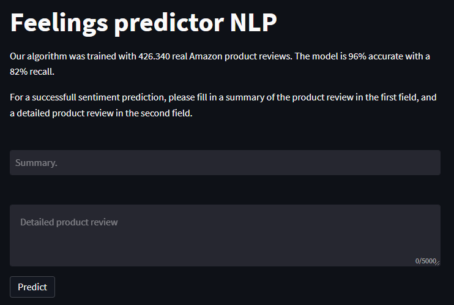

## Feelings predictor NLP.

#### Proyecto Integrador, Data Science - Digital House /// SEP 22 - APR 23 /// Duración: 420hs;

* **Integrantes:**
  - Eleonora Tubio. ([LinkedIn]());
  - Francisco Portas. ([LinkedIn](https://www.linkedin.com/in/francisco-portas/));
  - Juan Rojo. ([LinkedIn]());
  - María Pía Rodriguez Buteler. ([LinkedIn]());
  - Quaranta Gianfranco Enzo. ([LinkedIn](https://www.linkedin.com/in/gianfranco-quaranta-/));

- **Dataset**
Algoritmo entrenado con un dataset de 426.340 registros de reviews de Amazon, el mismo se encuentra disponible en el siguiente link:

  - Link: [Dataset](https://www.kaggle.com/datasets/arhamrumi/amazon-product-reviews?resource=download)

* **Objetivo:**
Predecir con un alto nivel de fidelidad el sentimiento que representa una review de un producto en amazon.

- **Enfoque:**
El modelo fue entrenado analizando la relación entre el texto del título de la review, la descripción de la misma, las palabras utilizadas y la puntuación de 1 a 5 estrellitas (de [1, 2], el comentario es negativo, de [3, 5] comentarios positivos). 

* **Desafío:**
Dataset desbalanceado 90/10, muy pocos comentarios negativos, por lo que tuvimos que probar varias configuraciones para llegar al resultado final.

- **Resultado:**
Predecimos con un 96% de precisión y un 82% de recall, si el comentario ingresado es un comentario:
  - Positivo: 3 o más estrellas.
  - Negativo:  de 1 a 2 estrellas.

Con una hipótesis nula de 85.5%.

Logramos una mejora considerable de 10.5%.

- **Deploy**
Realizamos el deploy del modelo en [streamlit](https://streamlit.io/) para que pueda ser utilizado libremente.

* **Pruébalo tu mismo:**
  * Link: [Feelinks Predictor App NLP.](https://gianfrancoquaranta-feelings-predictor-nlp-myapp-tj44k7.streamlit.app/) 

- **Conclusión**
Objetivo cumplido, se ha logrado un excelente trabajo en equipo, integrador aprobado y reconocido como uno de los mejores de nuestra comisión.